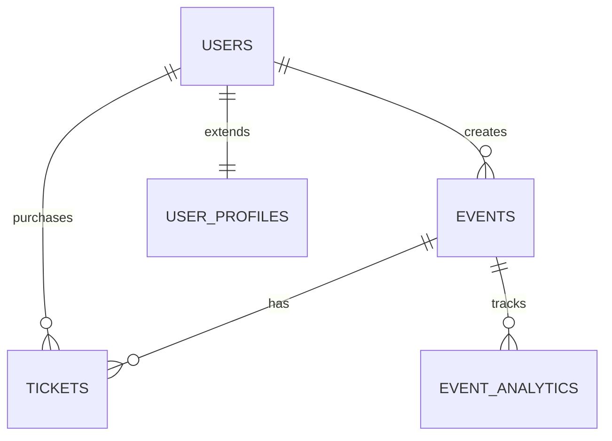

# Festos Database Schema

This directory contains the complete database schema for the Festos event platform, organized following clean code architecture principles.

## 📁 Directory Structure

```
database/
├── README.md                 # This file
├── init.sql                  # Main initialization script
├── schemas/                  # Table definitions
│   ├── 01_extensions.sql     # PostgreSQL extensions
│   ├── 02_core_tables.sql    # Core business entities
│   ├── 03_supporting_tables.sql # Supporting functionality
│   └── 04_indexes.sql        # Performance indexes
├── functions/                # Database functions and automation
│   ├── 01_triggers.sql       # Triggers and functions
│   └── 02_security.sql       # RLS policies
├── seeds/                    # Default data
│   ├── 01_categories.sql     # Event categories
│   └── 02_tags.sql           # Event tags
├── migrations/               # Database migrations (future)
└── views/                    # Database views (future)
```

## 🚀 Quick Start

### Option 1: Run All at Once
```sql
-- In Supabase SQL editor, run:
\i database/init.sql
```

### Option 2: Run Individual Files
```sql
-- Run in order:
\i database/schemas/01_extensions.sql
\i database/schemas/02_core_tables.sql
\i database/schemas/03_supporting_tables.sql
\i database/schemas/04_indexes.sql
\i database/functions/01_triggers.sql
\i database/functions/02_security.sql
\i database/seeds/01_categories.sql
\i database/seeds/02_tags.sql
```

### Option 3: Copy and Paste
For Supabase dashboard, copy and paste the contents of each file in order.

## 📋 Schema Overview

### Core Tables
- **users**: User accounts with wallet authentication
- **events**: Event management with blockchain integration  
- **tickets**: Event registrations and purchases

### Supporting Tables
- **user_profiles**: Extended user information
- **event_categories**: Event categorization system
- **event_tags**: Flexible tagging system
- **event_analytics**: Performance tracking
- **user_sessions**: Session management

## 🔒 Security Features

- **Row Level Security (RLS)** enabled on all tables
- **Wallet-based authentication** with JWT claims
- **Data isolation** - users can only access their own data
- **Public/private event** visibility controls

## ⚡ Performance Optimization

- **Strategic indexes** on frequently queried columns
- **Foreign key indexes** for join optimization
- **Unique constraints** for data integrity
- **Automatic timestamp updates** via triggers

## 🎯 Key Features

### Authentication
- Wallet-based user authentication
- Optional email integration
- Session management with expiration

### Event Management
- Comprehensive event data model
- Blockchain integration support
- IPFS/Web3Storage integration
- Multiple visibility levels
- POAP integration

### Analytics
- Daily event analytics tracking
- View and engagement metrics
- Revenue tracking
- Performance monitoring

### Categorization
- Predefined event categories
- Flexible tagging system
- Usage tracking for tags

## 🔧 Configuration

### Environment Variables
After running the schema, configure these in your application:

```env
# Supabase Configuration
NEXT_PUBLIC_SUPABASE_URL=your_supabase_url
NEXT_PUBLIC_SUPABASE_ANON_KEY=your_supabase_anon_key
SUPABASE_SERVICE_ROLE_KEY=your_service_role_key
```

### RLS Policies
The schema includes RLS policies that work with JWT claims. Ensure your application sets:

```javascript
// JWT claims should include:
{
  "wallet_address": "0x...",
  "role": "authenticated"
}
```

## 🧪 Testing

### Verify Installation
```sql
-- Check if all tables exist
SELECT table_name 
FROM information_schema.tables 
WHERE table_schema = 'public' 
ORDER BY table_name;

-- Check if RLS is enabled
SELECT schemaname, tablename, rowsecurity 
FROM pg_tables 
WHERE schemaname = 'public' 
AND rowsecurity = true;
```

### Sample Data
```sql
-- Create a test user
INSERT INTO public.users (wallet_address, username, email) 
VALUES ('0x1234...', 'testuser', 'test@example.com');

-- Create a test event
INSERT INTO public.events (title, description, location, start_date, end_date, creator_id)
SELECT 'Test Event', 'A test event', 'Virtual', NOW() + INTERVAL '1 day', NOW() + INTERVAL '2 days', id
FROM public.users WHERE wallet_address = '0x1234...';
```

## 📚 Documentation

### Table Relationships


### Indexes Strategy
- Primary keys: Automatic B-tree indexes
- Foreign keys: Explicit indexes for join performance
- Search columns: Indexes on frequently filtered columns
- Unique constraints: Automatic unique indexes

## 🔄 Migrations

Future database changes should be added to the `migrations/` directory with:
- Timestamp-based naming: `YYYYMMDD_HHMMSS_description.sql`
- Idempotent operations using `IF NOT EXISTS`
- Rollback scripts where applicable

## 🆘 Troubleshooting

### Common Issues

**Tables not created**
- Ensure extensions are enabled first
- Check for syntax errors in SQL
- Verify Supabase project permissions

**RLS blocking queries**
- Verify JWT claims are set correctly
- Check policy conditions match your auth setup
- Test with service role key for debugging

**Performance issues**
- Analyze query execution plans
- Verify indexes are being used
- Consider additional indexes for specific queries

## 📄 License

This database schema is part of the Festos project and follows the same license terms.

---

For questions or issues, please refer to the main project documentation or create an issue in the project repository.
